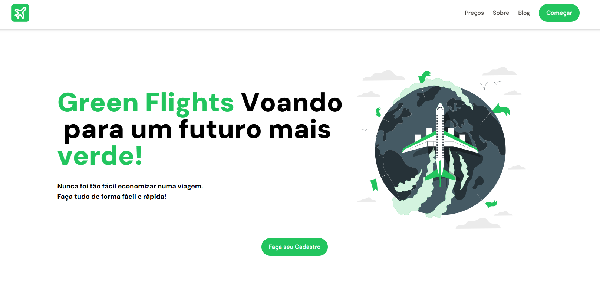

# Landing Page - Green Flights ✈️



> A draft of the landing page for "Green Flights", a fictional airline. This project was created to showcase advanced front-end development skills using Next.js, Tailwind CSS, and Framer Motion.

🔗 **[Access the demo here!](https://green-flights-beige.vercel.app/)**

---

## 📖 About the Project

The **Green Flights** project is a landing page concept for a modern, fictional airline. The idea was to create a clean, attractive, and high-performance interface, focusing on a fluid and pleasant user experience.

The main objective was to apply and deepen my knowledge in the following areas:
* **Development with Next.js:** Utilizing its structure for optimized rendering and SEO.
* **Styling with Tailwind CSS:** Creating a custom and responsive design system in an agile manner.
* **Animations with Framer Motion:** Adding micro-interactions and animations that bring the page to life and enhance navigation.

---

## 🛠️ Technologies Used

This project was built with the latest from the JavaScript/React ecosystem:

* **Framework:** **[Next.js](https://nextjs.org/)**
* **Language:** **[TypeScript](https://www.typescriptlang.org/)**
* **Styling:** **[Tailwind CSS](https://tailwindcss.com/)**
* **Animations:** **[Framer Motion](https://www.framer.com/motion/)**
* **Deploy:** **[Vercel](https://vercel.com/)**

---

## ⚙️ How to Run the Project Locally

To run a copy of this project on your machine, follow the steps below.

```bash
# 1. Clone this repository
$ git clone https://github.com/Gemellix2322/Green-Flights-Landing-Page.git

# 2. Navigate to the main project directory
$ cd Green-Flights-Landing-Page

# 3. Install all necessary dependencies
$ npm install
# or
$ yarn install

# 4. Start the development server
$ npm run dev
# or
$ yarn dev
```

After running the commands, open http://localhost:3000 in your browser to see the project in action.

📝 License
This project is under the MIT license. It was created for portfolio purposes, so feel free to browse the code, but please give credit if you use it as inspiration.